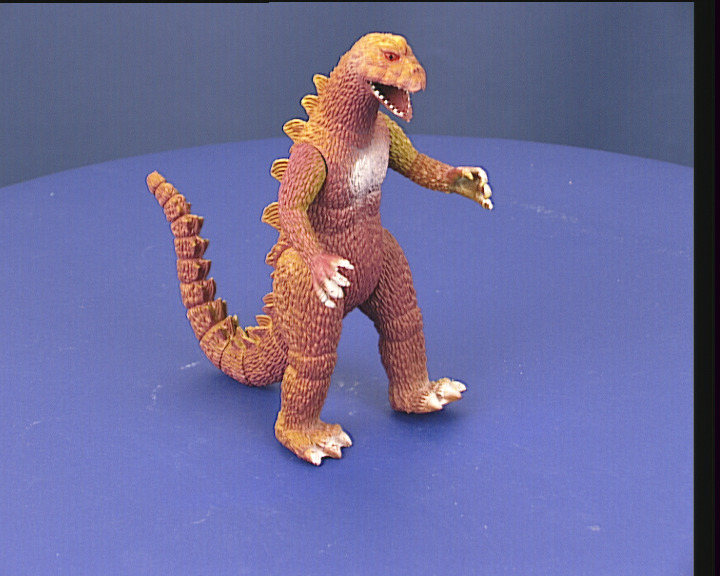
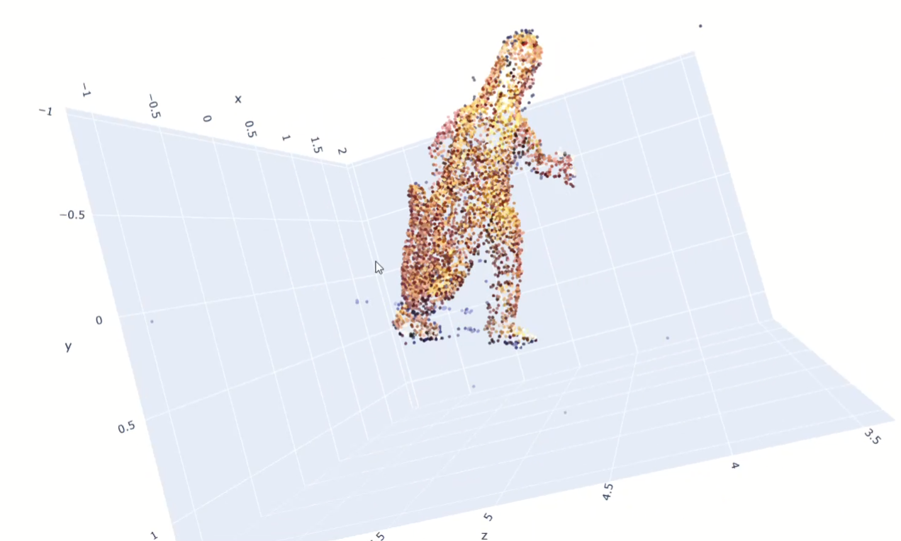

# 3D-Reconstruction - SfM

## Overview
The 3D Reconstruction project is a Python program capable of performing 3D reconstruction based on 2D images that cover every angle of the object you want to reconstruct, using the Structure from Motion (SfM) technique.

## Prerequisites
- **Python**: Install Python 3.9 or higher.

## Installation and Setup

Clone the repository to your computer using the following command in your console:
```sh
    git clone https://github.com/GMR-AI/3D-Reconstruction.git
```

If you want to use your own dataset, make sure to take enough images of the object so the model can achieve higher precision in the reconstruction. Also, change the path directory in the ``code/main.py`` file to your own directory where your dataset is located.
```sh
    python ./3D-Reconstruction/code/main.py
```

## Usage

In case you want to to use your own dataset make sure to make enough images of the object so the model can have more precision in the reconstruction. Also change the path directory in the code/main.py file to your own directory where it has your dataset.

## Result

Here is a demonstration of the 3D reconstruction of the dinosaur:

<p float="left">
  
   
</p>

## Contributing
1. Fork the repository.
2. Create a new branch.
3. Make your changes.
4. Submit a pull request.

## License
This project is licensed under the MIT License.

For any issues or questions, please open an issue on the project's GitHub page.